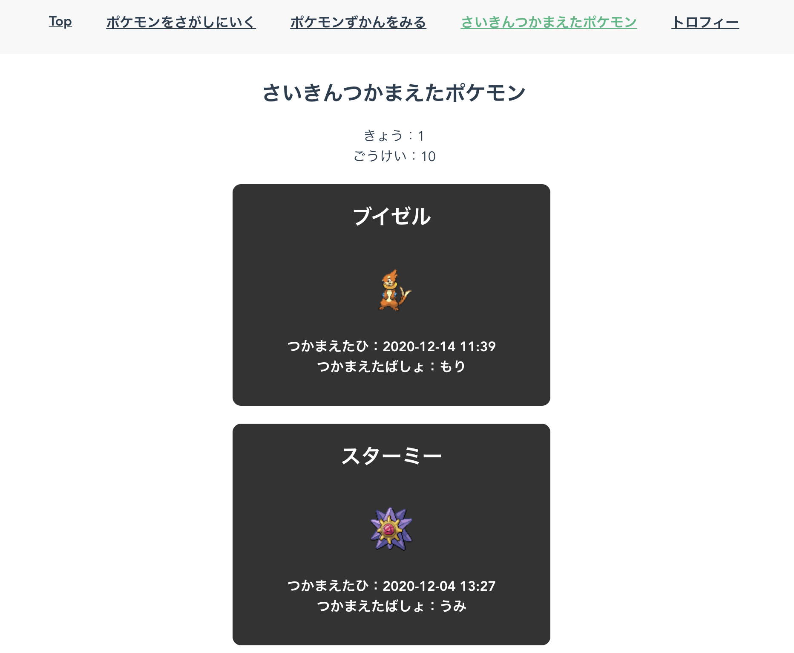

# ポケモンSPAのお手本

## 引用元

- 著者: azukiazusa1

- [Github](https://github.com/azukiazusa1/Pokomeon-get-Adventure)

- [Qiita記事](https://qiita.com/azukiazusa/items/40abd9491e273e85ded4)

## (1) インストール手順
[インストール手順](./github/installation.md)

## (2) チーム内のタスク分け
[チーム内のタスク分け](./github/tasks.md)

## (3) 新しいブランチを切る手順
[新しいブランチを切る手順](./github/new_branch.md)

## (4) プルリクを出す前に行うこと
[プルリクを出す前に行うこと](./github/before_pr.md)

## [入門書] JSPrimer

[JSPrimer](https://jsprimer.net/)

## [チュートリアル] Vue.jsコンポーネント入門

[Vue.jsコンポーネント入門](https://www.hypertextcandy.com/vuejs-components-introduction-environment-setting)

## Node.jsバージョン

- 12系
  - (Maltese) v12.4.0  
  - (Kamo)

## Prettierの導入

~~~sh
npm run prettier-write
~~~